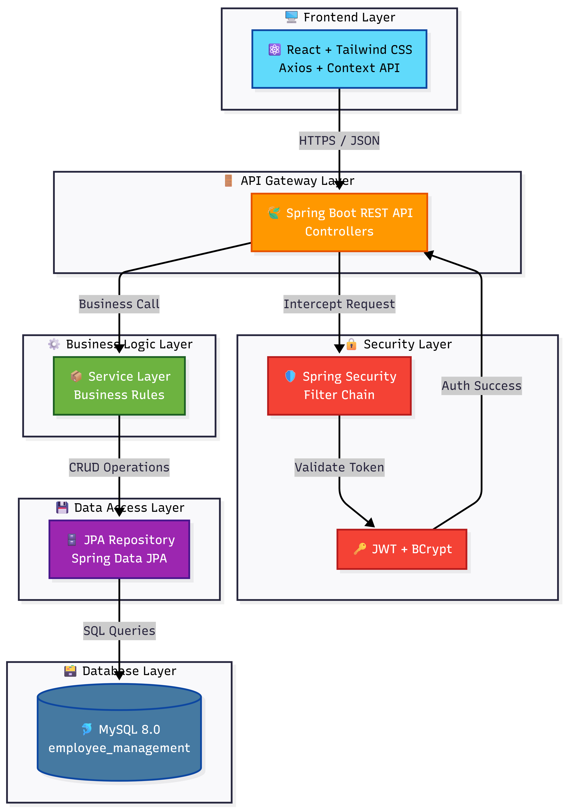
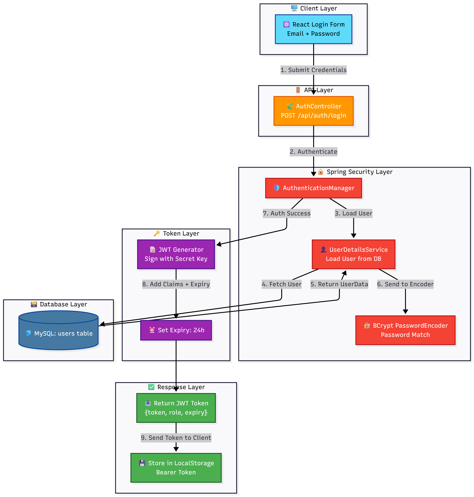
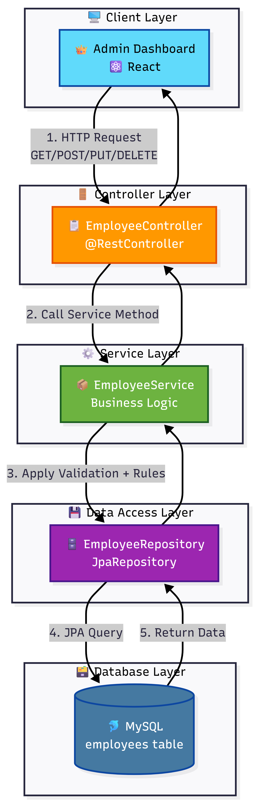
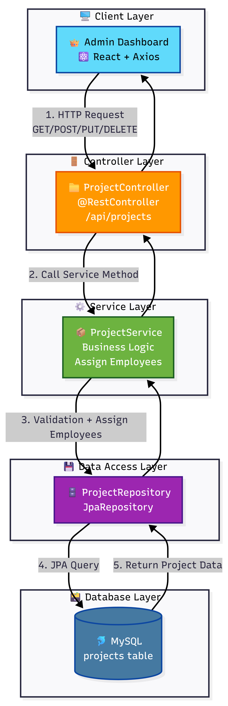
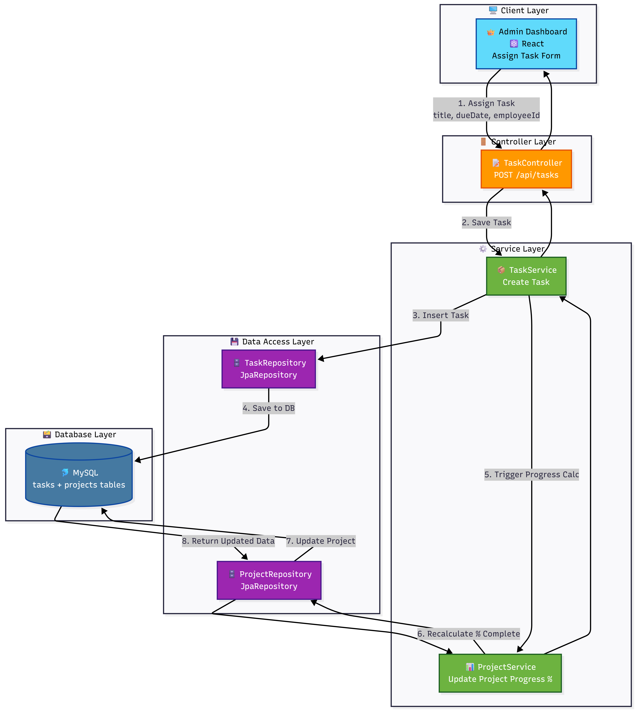
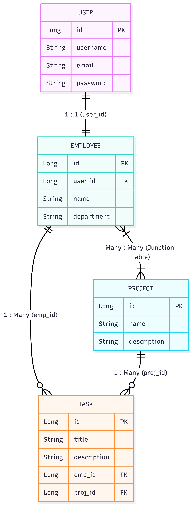

# Employee Management System

A full-stack Employee Management System built using **Spring Boot**, **React**, **MySQL**, and **JWT Authentication**.

---

## Application Architecture



# Features

## Authentication

- JWT Authentication
- Secure Login
- Role Based Authorization
- BCrypt Password Encryption

## Auth Flow chart



---

## Employee Management

- Create Employee
- Update Employee
- Delete Employee
- View Employee Details
- Search Employees
- Employee Profile

## Employee Flow chart




---

## Project Management

- Create Projects
- Update Projects
- Delete Projects
- Assign Employees
- Remove Employees
- Automatic Project Progress Calculation

## Project Flow chart



---

## Task Management

- Create Tasks
- Assign Tasks
- Update Task Status
- Update Task Priority
- Due Date Management
- Project Progress Auto Update

## Task Flow chart




---

## Dashboard

### Admin Dashboard

- Total Employees
- Total Projects
- Active Projects
- Completed Projects
- Total Tasks
- Pending Tasks
- Completed Tasks
- Overdue Tasks
- Recent Activities

### Employee Dashboard

- Assigned Tasks
- Completed Tasks
- Upcoming Deadlines

---

## Reports

- Employee Performance
- Project Reports
- Task Reports
- Dashboard Analytics

---

# Tech Stack

## Frontend

- React
- React Router
- Axios
- Tailwind CSS
- Context API
- Dark Theme

---

## Backend

- Spring Boot
- Spring Security
- Spring Data JPA
- JWT
- Lombok
- Maven

---

## Database

- MySQL

---

## Installation

### Clone Repository

```bash
git clone https://github.com/your-username/Employee-Management-System.git
```

---

## Backend

```bash
cd backend
```

Configure

application.properties

```properties
spring.application.name=backend

# ==============================
# MySQL Configuration
# ==============================

spring.datasource.url=jdbc:mysql://localhost:3306/employee_management
spring.datasource.username=root
spring.datasource.password=root123

spring.datasource.driver-class-name=com.mysql.cj.jdbc.Driver

# ==============================
# JPA Configuration
# ==============================

spring.jpa.hibernate.ddl-auto=update

spring.jpa.show-sql=false
spring.jpa.properties.hibernate.format_sql=false

# Completely silence Hibernate SQL logging
logging.level.org.hibernate.SQL=OFF
logging.level.org.hibernate.type.descriptor.sql=OFF
logging.level.org.hibernate.orm.jdbc.bind=OFF

# ==============================
# Server
# ==============================

server.port=8080

# ==============================
# JWT Configuration
# ==============================

jwt.secret=ThisIsMyVerySecretKeyForEmployeeManagementProject2026
jwt.expiration=86400000

# ==============================
# Multipart File Upload Configuration
# ==============================
spring.servlet.multipart.max-file-size=15MB
spring.servlet.multipart.max-request-size=15MB
```

Run

```bash
mvn spring-boot:run
```

Backend

```
http://localhost:8080
```

---

## Frontend

```bash
cd frontend

npm install

npm run dev
```

Frontend

```
http://localhost:5173
```

---

# Default Admin

Email

```
suhail@gmail.com
```

Password

```
admin@123
```

---

# API Authentication

```
Authorization

Bearer <JWT_TOKEN>
```

---

# Folder Structure

```
backend/
frontend/
database/
postman/
screenshots/
flowcharts/
README.md
```

---

# Project Modules

- Authentication
- Employee
- Project
- Employee Project Assignment
- Task
- Dashboard
- Reports

---

# Screenshots

check the below folder

```
screenshots/
```

---

# Database

SQL Scripts

```
database/
```

### Entity Relationship Diagram



*Database schema showing relationships between Employee, Project, Task, and User tables*

Contains

- Database Schema

---

# Postman Collection

Located in

```
postman/
```

Import directly into Postman.

---

# Future Improvements

- Email Notifications
- Swagger API Documentation
- File Upload
- Profile Image Storage
- Docker Deployment

---

# Author

Mohammed Suhail
